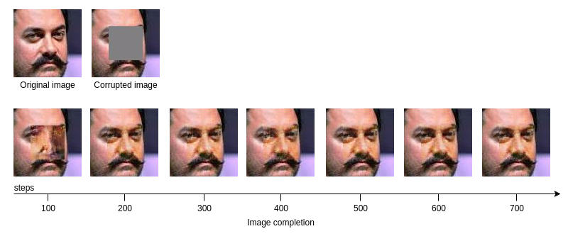
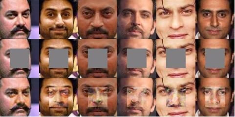
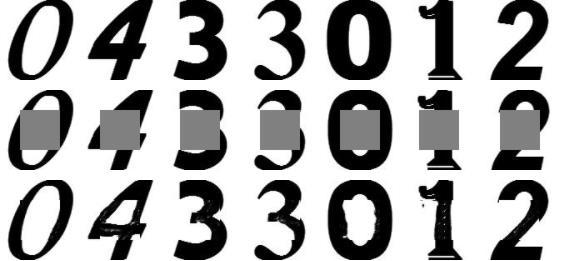

### Image Completion using Deep Convolutional Generative Adversarial Nets

Image inpainting refers to the task of filling up the missing or corrupted parts of an image. A context aware image inpainting method should be capable of suggesting new and relevant content for completing an image. This requires the system to have an understanding of the overall semantics of the image. This is where generative adversarial nets come into play.



### 1. Motivation

The idea of a system that fills up missing content of an image poses so many questions.

- How would an AI know to do it?
- How would the human brain do it?
- What kind of information is required to do it?

The kind of information that is required to fill in missing content in an image would be:

*Contextual information* – the surrounding pixels provide information about the missing pixels.

*Perceptual information* – knowledge of the fact that the generated image looks "normal", like what would have been seen in the real world.

Without contextual information, it is impossible to know the type of information that is required to fill in for the missing content. Perceptual information plays the role of an adversary saying whether the new content looks like what would be a good solution or not, as there can be multiple valid solutions given some context.

An intuitive algorithm that captures both of these properties that say how to complete an image, step-by-step, is a much harder task. And nobody knows how to build such an algorithm. The best approach would be to utilize statistics and machine learning to learn an approximate technique.

### 2. Method

Image inpainting is performed once the DCGAN is trained. That means the generator, `G`, can generate realistic looking images, and the discriminator, `D`, is able to separate the "fake" from the "real".

##### Finding the best fake image for image completion:

Now, to complete an image `y`, something that does not work in to maximize `D(y)` over
the missing pixels. This procedure may result in something that is neither from the data
distribution, nor the generative distribution. It is required to find a reasonable projection of `y` onto the generative distribution.

##### Loss functions for projecting onto the generative distribution:

In order to represent the corrupted parts of an image, a binary mask `M` that has values
0 or 1, is used. The value 1 represents the parts of the image that are to be kept and 0
represents the parts of the image that are to be completed. Multiplying the elements of
the original image `y` by the elements of `M` gives the original part of the image. The
element-wise product of the two matrices if represented as, `M⨀y`.

Next, suppose we found an image from the generator `G(ẑ)` for some `ẑ` that provides a
reasonable reconstruction of the corrupted parts. The reconstructed pixels can then be
added to the original pixels to create the final reconstructed image.

(I shall upload the full documentation sometime soon.)

### 3. Results

Inpainting on face images. **Row 1:** Real images before corruption. **Row 2:** Corrupted images. **Row 3:** Reconstructed images.



Inpainting on images from Chars74K dataset. **Row 1:** Real images before corruption. **Row 2:** Corrupted images. **Row 3:** Reconstructed images.



### 4. Try Yourself

##### Setup and run:

```bash
pip3 install --user tensorflow

git clone https://github.com/marcreyesph/dcgan-image-completion
cd dcgan-image-completion

# Train
python3 main.py

# Generate
python3 main.py --nois_train --latest_ckpt 100000

# Complete
python3 main.py --is_complete --latest_ckpt 50000 --complete_src /path/to/images
```

##### Run on floydhub:

```bash
pip3 install --user floyd-cli
~/.local/bin/floyd login

git clone https://github.com/marcreyesph/dcgan-image-completion
cd dcgan-image-completion

~/.local/bin/floyd init ImageCompletion-DCGAN
~/.local/bin/floyd run --gpu --env tensorflow-1.0 "python main.py --log_dir /output --images_dir /output"
```
